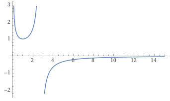

# Problème 1, analyse (obligatoire, 12 points)
## a)
$ED = R_+^* - [e]$

## b)
La fonction ne croise pas l'axe des X ni des Y.

## c)
$a_1: x = 0$

$a_2: x = e$

$a_3: y = 0$

## d)
$f'(x) = \frac{ln(x)}{x^2(1-ln(x))^2}$

## e)
La fonction décroit entre 0 et 1 puis croit entre 1 et l'infini. Il y a un mininum local $min(1)$

## f)
{ width=50% }

## g)
$t: y = \frac{2}{e^4}x - \frac{3}{e^2}$

$x = \frac{3}{2}e^2$

## h)
$F(x) = -ln|1-ln(x)|$

