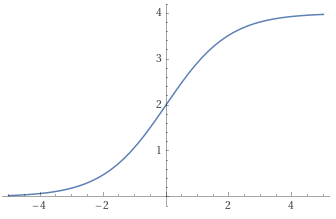

# Problème 1, analyse (obligatoire, 12 points)
## a)
$ED = R$

## b)
a = 4

## c)
En utilisant $(\frac{f}{g})'(x) = \frac{f'(x)g(x) - f(x)g'(x)}{g^2(x)}$
avec $f(x) = 4e^x $ et $ g(x) = 1 + e^x$ et donc $f'(x) = 4e^x$ et $g'(x) = e^x 

$f'(x)g(x) - f(x)g'(x) = 4e^x + 4e^{2x} - 4e^{2x} = 4e^x$

Et donc $f'(x) = \frac{4e^x}{(1+e^x)^2}$ 

Le signe de $f'(x)$ est toujours positif, donc la fonction croît toujours.

## d)
$f''(x) = \frac{4e^x(1 - e^x)}{(1 + e^x)^3}$
$f''(x) = 0 \rightarrow 1 - e^x = 0 \rightarrow e^x = 1 -> x = 0$
Il y a un point d'inflexion à $x = 0, y = 4/2 = 2$

## e)
{ width=50% }

## f)
De $f'(0) = 1$ et $f(0) = 2$ on obtient $y = x + 2$

## g)
$F(x) = 4ln(1 + e^x)$

$F(2) = 4ln(1 + e^2)$

$F(-2) = 4ln(1 + e^{-2})$

$\int_{-2}^2 f(x)dx = F(2) - F(-2) = 4ln(\frac{1 + e^2}{1 + e^{-2}}) = 8$

